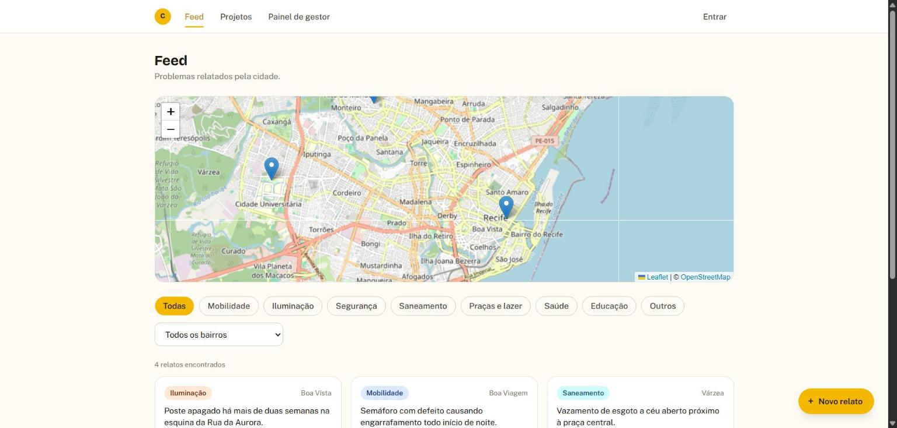

# Confluência

**Plataforma cívica digital para o Recife** · React · TypeScript · Supabase

[](https://confluencia-liart.vercel.app)
[](https://react.dev)
[](https://www.typescriptlang.org)
[](https://tailwindcss.com)
[](https://supabase.com)
[](LICENSE)

Conecta a população do Recife à gestão pública: o cidadão relata um problema, o relato ganha visibilidade proporcional à sua gravidade e recorrência, o governo responde com um projeto formal, e a população acompanha e vota numa consulta pública até a conclusão da obra.

🔗 **Demo:** [confluencia-liart.vercel.app](https://confluencia-liart.vercel.app)
*(ainda sem projeto Supabase real conectado — Feed e Projetos funcionam com dados de demonstração; ver [status atual](#status-atual))*



> Projeto de disciplina do 4º período, construído em equipe de três pessoas. **Apresentação: 05/11/2026.**

## Sobre o projeto

Confluência fecha um ciclo que hoje normalmente não existe entre cidadão e governo: relato → repercussão → resposta oficial → consulta pública → execução acompanhada publicamente. O nome remete à imagem de rios se encontrando — uma metáfora para o encontro entre governo e população num mesmo espaço de diálogo.

O produto tem dois módulos principais. O **Feed** é o canal de baixo para cima: qualquer cidadão relata um problema urbano (categoria, descrição, foto opcional, localização no mapa), e o post ganha um nível de repercussão combinando recorrência de relatos parecidos na região com engajamento — pensado para não deixar bairros com mais acesso à internet dominarem a visibilidade em detrimento de áreas periféricas. O **Projetos** é o canal de cima para baixo: órgãos públicos verificados publicam projetos urbanos, que passam por consulta pública (voto secreto, mas auditável, via hash de comprovante) antes de ganhar uma linha do tempo de execução pública.

## Funcionalidades

- Criar, listar e filtrar relatos do Feed por categoria e bairro, com mapa interativo (React Leaflet) e clusterização
- Cálculo de repercussão por recorrência + engajamento, com indicador visual de 3 níveis
- Publicar projetos como órgão público verificado, com linha do tempo de execução (previsto × real)
- Consulta pública com votação secreta e auditável (hash de comprovante, bloqueio de voto duplicado no banco)
- Painel de gestor, visível só a contas institucionais, com projetos inclusive os rejeitados na consulta
- Autenticação via Supabase (cadastro/login por e-mail e senha)
- Interface animada (Framer Motion): transições de página, pills de filtro com indicador deslizante, entrada escalonada de cards

## Status atual

Veja o [Pull Request #1](https://github.com/joaobatis1a/confluencia/pull/1) para o estado mais atualizado — Feed e Projetos já funcionam de ponta a ponta com dados de demonstração; falta só um projeto Supabase real (migrations prontas em `supabase/migrations/`) para os dados serem persistidos de verdade.

## Equipe

| Pessoa | Frente | GitHub |
|---|---|---|
| João Batista (líder) | Frontend Feed + Geolocalização | [@joaobatis1a](https://github.com/joaobatis1a) |
| Ana Beatriz | Frontend Projetos + apoio ao banco | [@anabeatrizlsf](https://github.com/anabeatrizlsf) |
| Guilherme Araújo | Backend / Auth / Votação / Deploy | [@guiaraujoo](https://github.com/guiaraujoo) |

## Stack

- **[React 19](https://react.dev)** + **TypeScript** + **[Vite](https://vite.dev)**
- **[Tailwind CSS v4](https://tailwindcss.com)**, tokens do design system aplicados em `src/index.css`
- **[Framer Motion](https://www.framer.com/motion/)**, animações e transições de página
- **[Supabase](https://supabase.com)**, Postgres + Auth + Row Level Security
- **[React Leaflet](https://react-leaflet.js.org/)**, mapa interativo do Recife
- **[Vercel](https://vercel.com)**, deploy do frontend, conectado ao repositório

## Estrutura de pastas

```
src/
  features/
    feed/       # módulo Feed (João)
    projetos/   # módulo Projetos (Ana)
  components/   # componentes compartilhados (mapa, pills, badges, UI)
  context/      # AuthContext (Supabase Auth)
  lib/          # cliente Supabase, helpers de categoria/repercussão
  types/        # contrato de dados (Post, Projeto, Voto, Profile)
supabase/
  migrations/   # schema SQL + RLS (Guilherme)
docs/
  cronograma-atualizado.md
  contrato-de-dados.md
```

## Como rodar localmente

```bash
git clone https://github.com/joaobatis1a/confluencia.git
cd confluencia
npm install
cp .env.example .env.local   # preencha com as chaves do Supabase (Project Settings > API)
npm run dev
```

Sem `.env.local` preenchido, o app roda normalmente com dados mock — só login e gravações reais não funcionam.

## Fluxo de trabalho (Git)

**Ninguém commita direto na `main`.** Toda tarefa nasce numa branch própria (`feature/`, `fix/`, `chore/`, `docs/`) e só entra via Pull Request revisado pelo líder.

Cada integrante tem uma branch inicial para começar: `joao/feed-geolocalizacao`, `ana/projetos-frontend`, `guilherme/backend-core`. Detalhes completos do fluxo de Git/PR estão nos guias do líder e do time (fora deste repositório, nos documentos de planejamento).

## Deploy

Projeto conectado ao Vercel via integração Git — toda branch/PR nova ganha preview automático. `vercel.json` tem o rewrite de SPA necessário pro React Router funcionar em rotas acessadas direto (sem isso, `/feed` ou `/projetos/:id` retornam 404 fora da home).

## Documentação do projeto

- [`docs/cronograma-atualizado.md`](docs/cronograma-atualizado.md) — cronograma até a apresentação (05/11)
- [`docs/contrato-de-dados.md`](docs/contrato-de-dados.md) — campos de cada tabela do banco
- Guias individuais (PDF, um por integrante) e design system (`confluencia-design.pdf` v2.1) — fora deste repositório, nos documentos de planejamento

## Licença

Distribuído sob a licença MIT — veja [`LICENSE`](LICENSE). Projeto de autoria conjunta de João Batista, Ana Beatriz e Guilherme Araújo.
